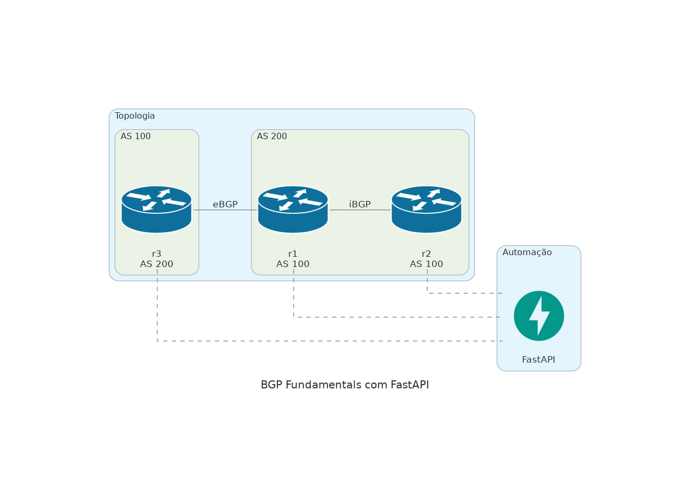

## Topologia



# Tarefa 1: Configurar Peering eBGP

Nesta tarefa, você configurará o BGP externo (eBGP) entre o R1 no AS 100 e o R3 no AS 200. Seu objetivo é estabelecer uma relação de vizinhança BGP e anunciar interfaces *loopback* para que cada roteador possa alcançar as redes do outro.

> Execute `autonetops task 1` para configurar essa task
#### Passos
1. No R1:
   - Configure o BGP com o AS 100.
   - Adicione o R3 (192.168.13.3) como vizinho eBGP.
   - Anuncie o *loopback0* (1.1.1.1/32) e o *loopback1* (10.1.0.1/32) usando um comando *network*.
2. No R3:
   - Configure o BGP com o AS 200.
   - Adicione o R1 (192.168.13.1) como vizinho eBGP.
   - Anuncie o *loopback0* (3.3.3.3/32).
3. Verifique o status dos vizinhos BGP usando `show ip bgp summary`.
4. Verifique a tabela BGP com `show ip bgp` para garantir que as rotas foram trocadas.
5. Teste a conectividade fazendo um *ping* de 3.3.3.3 a partir do R1 e de 1.1.1.1 a partir do R3.

#### Entregáveis
- O BGP está ativo entre R1 e R3.
- O R1 pode fazer *ping* em 3.3.3.3, e o R3 pode fazer *ping* em 1.1.1.1 e 10.1.0.1.


---
# Tarefa 2: Configurar iBGP com Next-Hop-Self

> Execute `autonetops task 2` para configurar essa task

Agora, configure o BGP interno (iBGP) entre R1 e R2 dentro do AS 100. Como o R2 não está diretamente conectado ao R3, o R1 deve compartilhar as rotas do AS 200 com o R2. Você usará o recurso *next-hop-self* para fazer isso funcionar.

#### Passos
1. No R1:
   - Adicione o R2 (2.2.2.2) como vizinho iBGP usando endereços *loopback* para estabilidade.
   - Habilite o `next-hop-self` para o vizinho R2.
   - Atualize a tabela de roteamento para incluir o *loopback* do R2 (rota estática ou IGP).
2. No R2:
   - Configure o BGP com o AS 100.
   - Adicione o R1 (1.1.1.1) como vizinho iBGP usando endereços *loopback*.
   - Anuncie o *loopback0* (2.2.2.2/32) e o *loopback2* (10.2.0.1/32).
   - Adicione uma rota estática para alcançar 1.1.1.1 via 192.168.12.1.
3. Verifique com `show ip bgp` no R2 que ele enxerga 3.3.3.3/32 vindo do R1.
4. Teste fazendo um *ping* de 3.3.3.3 a partir do R2.

#### Dica
Sem o `next-hop-self`, o R2 não saberá como alcançar o IP de próximo salto do R3 (192.168.13.3). Esse é um conceito chave do BGP!

#### Entregáveis
- O iBGP está ativo entre R1 e R2.

---
# Tarefa 3: Solucionar Problemas no BGP

> Execute `autonetops task 3` para configurar essa task

Algo está errado! O R2 não consegue ver o prefixo 10.1.0.0/24 do R1, mesmo que o R1 esteja anunciando para o R3. Investigue e corrija o problema.

#### Passos
1. Verifique a tabela BGP no R2 (`show ip bgp`)—o 10.1.0.1/32 está presente?
2. No R1, examine a configuração BGP (`show run | section bgp`).
3. Procure por filtros, políticas ou comandos ausentes que possam estar bloqueando o anúncio para o R2.
4. Corrija o problema e confirme que o R2 agora vê o 10.1.0.1/32.
5. Teste fazendo um *ping* de 10.1.0.1 a partir do R2.

#### Dica
Compare o que o R3 vê com o que o R2 vê. O R1 está tratando seus vizinhos de forma diferente?

#### Entregáveis
- A tabela BGP do R2 inclui 10.1.0.1/32.
- *Ping* bem-sucedido de R2 para 10.1.0.1.

---
# Tarefa 4: Implementar um Endpoint retornando a Topologia

Nesta tarefa, você criará um endpoint FastAPI que permite aos usuários verificar as informações de topologia de rede. Esse endpoint analisará o arquivo YAML e retornará os detalhes dos dispositivos em um dicionário global para uso em outras tarefas.

#### DNS da Topologia
 - clab-bgp_fundamentals-r1
 - clab-bgp_fundamentals-r2
 - clab-bgp_fundamentals-r3

#### Validar acesso aos dispositivos com NAPALM
 - napalm --help
 # Exemplo:
   napalm --user admin --password autonetops --vendor [ios/eos]clab-bgp_fundamentals-r1 call [get_facts,get_interfaces_ip,get_bgp_neighbors]

   [napalm_getters](https://napalm.readthedocs.io/en/latest/support/)


#### Passos
0. **Estrutura**
   - Crie um arquivo chamado main.py
   - Após escrever o código com FastAPI rode o servidor com:
     - (Documentaçao)[https://fastapi.tiangolo.com/]
   - Acesse seu servidor externamete com a seguinte URL:
     - echo $TF_VAR_VPN_CODESPACES_2222
     
1. **Definir o Endpoint**:
   - Um endpoint para o usuário ver qual a topologia e os acessos
   - Crie um endpoint `GET /topology` usando FastAPI.
   - Leia o arquivo `topology.yaml`
   - Retorne as informações para o usuário


#### Código Inicial
```python
from fastapi import FastAPI, HTTPException
import yaml

app = FastAPI()
```

#### Apos o codigo estiver pronto
   Subir o servidor FastAPI escutando na porta 2222:
    - fastapi run main.py --port 2222
   
   Acesso externo:
    - echo $TF_VAR_VPN_CODESPACES_2222
    - copie e cole no seu navegador com /docs

### [solucao](../solutions/task4.md)

---
### Tarefa 5: Modificar o Endpoint `/bgp/neighbors` para Aceitar um IP de Dispositivo

Nesta tarefa, você atualizará o endpoint existente `/bgp/neighbors` para aceitar um parâmetro `device_ip`. Isso permitirá que o endpoint recupere informações de vizinhos BGP de qualquer dispositivo especificado na topologia.

#### Passos
1. **Atualizar o Endpoint**:
   - Adicione um endpoint para `GET /bgp/neighbors/{device_ip}`.
   - Use o parâmetro de caminho `device_name` para especificar de qual dispositivo recuperar os vizinhos BGP.
   - Verifique se o `device_name` existe na topologia. Caso contrário, retorne um erro 404.

2. **Integrar com NAPALM**:
   - Use o tipo e as credenciais do dispositivo para se conectar via NAPALM.
   - Recupere os dados de vizinhos BGP usando o método `get_bgp_neighbors()` do NAPALM.

3. **Retornar os Dados de Vizinhos BGP**:
   - Retorne o IP do dispositivo e suas informações de vizinhos BGP em formato JSON.

#### Código Inicial
```python
from napalm import get_network_driver
from fastapi import HTTPException

@app.get("/bgp/neighbors/{device_name}")
def get_bgp_neighbors(device_name: str):
# Seu código aqui
```

### [solucao](../solutions/task5.md)